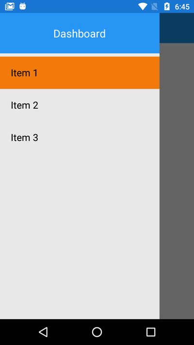

# xamarin-master-detail-page-mvvm-template
Created Master page template in Xamarin.Forms MVVM. 

# Introduction
This template is created for Master-Detail page in Xamarin.Forms MVVM arcitecture. This is will help to start any new project and same time to create basic arcitecture for the project. Just modify as per our requirements.

# Includes :
In this repository, there is added almost required fields like :

* Constants (Color and Thickness)
* Custom Controls (Controls like Label, Button, Picker, etc.)
* ViewModels (With BaseViewModel which contains basic code same for all ViewModels.)
* Views
* MasterPage
* CustomRenderers (In Android & iOS)

# How to add new page in MasterPage?
Add new page in masterpage in MainPage.xaml.cs file.

      public MainPage()
      {
         InitializeComponent();
         menuList = new List<MasterPageItem>();

         // Creating our pages for menu navigation
         // Here you can define title for item, 
         // icon on the left side, and page that you want to open after selection
         var page1 = new MasterPageItem() { Title = "Item 1",  TargetType = typeof(Views.Page1) }; //Icon = "address.png",
         var page2 = new MasterPageItem() { Title = "Item 2",  TargetType = typeof(Views.Page2) }; //Icon = "address.png",
         var page3 = new MasterPageItem() { Title = "Item 3",  TargetType = typeof(Views.Page3) }; //Icon = "address.png",

         // Adding menu items to menuList
         menuList.Add(page1);
         menuList.Add(page2);
         menuList.Add(page3);

         // Setting our list to be ItemSource for ListView in MainPage.xaml
         NavigationList.ItemsSource = menuList;

         // Initial navigation, this can be used for our home page
         Detail = new NavigationPage((Page)Activator.CreateInstance(typeof(Views.Page1)));
        }
